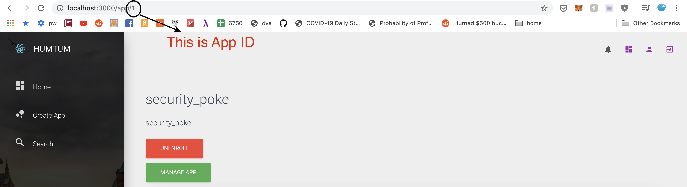

# Creating Electron client for your Humtum application “Security Poke”

## Introduction
Our application is constructed from the concepts and the codes in the article [How to Secure Electron Apps with OpenID Connect and OAuth 2.0](https://auth0.com/blog/securing-electron-applications-with-openid-connect-and-oauth-2/).
The original code is [here](https://github.com/auth0-blog/electron-openid-oauth)

It is recommended that you understand how to use Auth0 before starting developing on the Humtum platform

## How to start running this client
1. Create Humtum application Security Poke
Go through the Humtum application creation workflow. In this example, we created an application named security_poke. Once security_poke is created, take note of the ID of the app and the api identifier of the app, which is in the format `com.humtum.api.<app-name>`. For our example, the api identifier is `com.humtum.api.security_poke`.



2. Create third party client ID
Humtum Auth0 supports dynamic client registration based on the [OpenID Connect Dynamic Client Registration](https://openid.net/specs/openid-connect-registration-1_0.html) specification. Humtum Auth0 DOMAIN is humtum.auth0.com. Follow the instruction in this [link](https://auth0.com/docs/api-auth/dynamic-client-registration#register-your-application) to register a third party client ID. Replace YOUR_DOMAIN with `humtum.auth0.com`. For our examples, we can set the data to:
```json
{
"client_name": "SecurityPoke Electrion",
"redirect_uris": ["http://com.securitypoke.electron"]
}
```

You need to store the response somewhere secure.

3. Create environment files
Clone this repository. Go to `frontend` folder.
Create a file called env-variables.json with the following contents:
```json
{
  "apiIdentifier": "com.humtum.api.security_poke",
  "auth0Domain": "humtum.auth0.com",
  "clientId": <client-id>,
  "appId": <app-id>,
  "redirectUri": "http://com.securitypoke.electron"
}
```

4. Run the code
Run `npm start`


## Code walkthrough

The client uses Auth0 for authentications and authorizations. `auth-service.js` contains the neccessary code to authenticate the users to get the id token and request authorizations to get the access token. `humtum.js` is the library to contact with the humtum platform. You need to sign in with Auth0 before you can use Humtum.